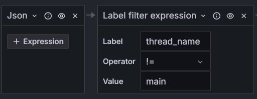

# Stattup logok elemzése

## Javítás
A JVM indulási ideje 12 másodperc, míg a nativ-é 200 msec.
Ezért a natív alkalamasabb a felhöhöz (rövidebb az indulási ideje.)

Jobb Request-Resaponse filter:

### loggingMode: file
Mivel az alkalamazás ekkor nem a standard outputra logol, így a  spring boot logon kivül más nem jelenik meg a naplóban.

Filter, gyakorlatilag a fenti képen is látható 3 mezőre van értelme beállítani. De mivel az alaklmazás logok enm jellenenk meg ennek nem sok gyakorlati haszna van - legfeljebb a többi alkalmazás vagy alaklamazás példánytól való elkülönítésére használhatjuk.

### loggingMode: file-json
Ekkor a springboot banner előtt megjelenik egy sor másik log is, de érdekességük, hogh a formátumok a beállítás ellenére nem JSON. 

Szűrni itt is legfeljebb a 3 mezőre van értelme. A megjelenet logok, és a spring banner logjainak elkülönítésére nincs érdemi módom (legfeljebb a line contetntnél ki tudom használni, hogy a spring boot logjai nem számmal kezdődnek):

Illetve magukra megjelenő logok sorainak tartalmára is szürhetek hasonlóan.
Ugyanakkor a müködés közben az alaklamazás eekkor sem logol semmit, hiszen nem a standard outputra logol.

### loggingMode: stdout
Ekkor a banner felett megjelenik az alkalmazás startup logja is.

De mivel az alklamazás nem json-ben logol, így érdemi (label alapú) filterezésem itt is legfeljebb arra a bizonyos 3 mezőre van. Ekkor a standard output miatt megjelenek a müködési logok is, de mivel a formátumulk ezeknek sem struktúrált (json), így nagyon korlátozottan tudok rájuk filterezni, leginkább a konkrét üzenettatrtalmak alapján a különféle Line operátorokkal. Az alábbi logrészleten látható, hogy a stacktracek például több log üzenetre törnek, melyek összetartozó leválogatása például lehetetlen lenne:

### loggingMode: stdout-json
Ebben az esetben a spring boot banner-t leszámítva minden log strukturált json formában jelenik meg:

A label alapú filterezési lehetőségeim így kinyilnak. Az alábbi képen aláhúztam ezeket:

Ezekre a label-ek szintjén tudok szürni.
Szintén megjelennek a működéi logok, struktúrált formában:

Ezeket el tudom egymástól különíteni a thread_name label alapján egymástól: 

De arra is van lehetőségem, hogy szürjek a logok szintjére: 

Látható továbbá, hogy a hibáknál a verem kivonat szintén egy elkülönült filedbe kerül:

 
Fent leírtakban a neativ helyett a jvm image-et hazsnéálva nem láttam lényegi különmbséget. Ezért mindkettőre igaz, hogy a **stdout-json** a megfelelő választás.

A két képfájlban a startupo logok alapján egy lényeges különbséget fedeztem fel. Ha alakalmazzuk ezt a szürést:

Akkor látható, hogy az a különbség, hogy a jvm csak az stdout logger profilt tartalmazza, míg a nativ mind a 45-et:

**Ami alapján a JVM image alaklamasabb a felhős használatra, hiszen a másik 3 profil használatánk nincs értelme ebben a környezetben.**

# Kérések logolásai
## A haszált szürő
")
## Logok:

