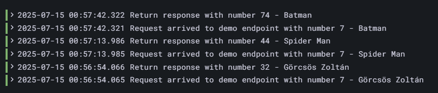

# Stattup logok elemzése

### loggingMode: file
Mivel az alkalmazás ekkor nem a standard outputra logol, így a  Spring boot logon kívül más nem jelenik meg a naplóban.

Filter, gyakorlatilag a fenti képen is látható 3 mezőre van értelme beállítani. De mivel az alkalmazás logok nem jellenek meg ennek nem sok gyakorlati haszna van - legfeljebb a többi alkalmazás vagy alkalmazás példánytól való elkülönítésére használhatjuk.

### loggingMode: file-json
Ekkor a Spring boot banner előtt megjelenik egy sor másik log is, de érdekességük, hogy a formátumok a beállítás ellenére nem JSON. 

Szűrni itt is legfeljebb a 3 mezőre van értelme. A megjelenet logok, és a Spring banner logjainak elkülönítésére nincs érdemi módom (legfeljebb a line contetntnél ki tudom használni, hogy a Spring boot logjai nem számmal kezdődnek):

Illetve magukra megjelenő logok sorainak tartalmára is szűrhetek hasonlóan.
Ugyanakkor a működés közben az alkalmazás ekkor sem logol semmit, hiszen nem a standard outputra logol.

### loggingMode: stdout
Ekkor a banner felett megjelenik az alkalmazás startup logja is.

De mivel az alkalmazás nem json-ben logol, így érdemi (label alapú) filterezésem itt is legfeljebb arra a bizonyos 3 mezőre van. Ekkor a standard output miatt megjelenek a működési logok is, de mivel a formátumuk ezeknek sem strukturált (json), így nagyon korlátozottan tudok rájuk filterezni, leginkább a konkrét üzenet tatrtalmak alapján a különféle Line operátorokkal. Az alábbi logrészleten látható, hogy a stacktracek például több log üzenetre törnek, melyek összetartozó leválogatása például lehetetlen lenne:

### loggingMode: stdout-json
Ebben az esetben a Spring boot banner-t leszámítva minden log strukturált json formában jelenik meg:

A label alapú filterezési lehetőségeim így kinyílnak. Az alábbi képen aláhúztam ezeket:

Ezekre a label-ek szintjén tudok szűrni.
Szintén megjelennek a működéi logok, struktúrált formában:

Ezeket el tudom egymástól különíteni a thread_name label alapján egymástól: 

De arra is van lehetőségem, hogy szűrjek a logok szintjére: 

Látható továbbá, hogy a hibáknál a verem kivonat szintén egy elkülönült field-be kerül:

 
Fent leírtakban a neativ helyett a jvm image-et használva nem láttam lényegi különbséget. Ezért mindkettőre igaz, hogy a **stdout-json** a megfelelő választás.

A két képfájlban startup logjait így tudjuk leszűrni:

**Itt a lényeges különbség a kétféle image közt, hogy a nativ image indulási ideje 12 másodperc, míg a jvm-é 200 msec.
Ezért a natív alkalmasabb a felhőhöz (rövidebb az indulási ideje.)**

# Kérések logolásai
## A használt szűrő
")
## Logok:

