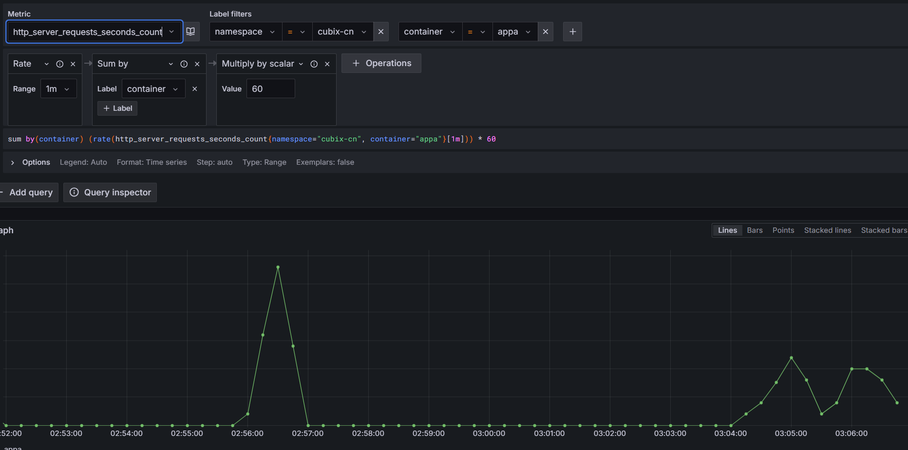

## Promethes lekérdezés az appa-ra pecenként beérkező kérésekről:

## Tracing

A fenti ábrán az látható, hogy az appa-hoz befutó kérés kisztolgálási idejének nagy részet az appb-be való áthívás adja, amíg az appb választ ad appa-nak. Ezért az appb a szük keresztmetszet.
